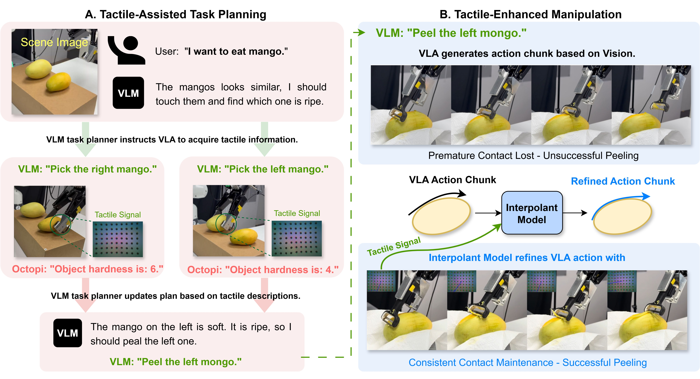
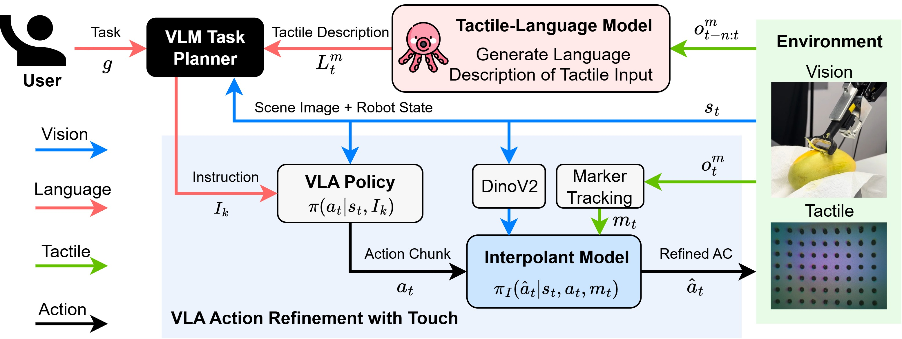

<p align="center">
  <h1 align="center">VLA-Touch: Enhancing Vision-Language-Action Models with Dual-Level Tactile Feedback</h1>
</p>


<!-- [](https://www.pytorch.org)
[](https://github.com/jxbi1010/KOAP/blob/master/LICENSE)
[](https://arxiv.org/abs/2410.07584)
[](https://icra2025.org)

This repo will release the code implementation for VLA-Touch:

<p align="center">&nbsp;<table><tr><td>
    <p align="center">
    <strong>
        <a href="https://arxiv.org/abs/2410.07584">
            VLA-Touch: Enhancing Vision-Language-Action Models with Dual-Level Tactile Feedback
        </a><br/>
    </strong>
    Jianxin Bi <sup>1</sup>, Kevin Ma <sup>1</sup>, Ce Hao <sup>1</sup>, Mike Zheng Shou <sup>1</sup>, Harold Soh <sup>1,2</sup><br>
    <sup>1</sup><em>Department of Computer Science, National University of Singapore</em><br>
    <sup>2</sup><em>Smart System Institute, NUS</em>
</td></tr></table>&nbsp; -->


# 🧾 Introduction


We present **VLA-Touch**, an approach that enhances generalist robot policies with tactile sensing *without fine-tuning* the base VLA. Our method introduces two key innovations: (1) a pipeline that leverages a pretrained tactile-language model that provides semantic tactile feedback for high-level task planning, and (2) a diffusion-based controller that refines VLA-generated actions with tactile signals for contact-rich manipulation. Through real-world experiments, we demonstrate that our dual-level integration of tactile feedback improves task planning efficiency while enhancing execution precision. 

<!-- <div align="center">
  
</div>


Figure 1: Overview of VLA-Touch. <b>Left:</b> Tactile-Assisted Task Planning—The VLM task planner actively acquires tactile feedback; Octopi interprets contacted objects and generates linguistic tactile descriptions to inform subsequent plans. <b>Right:</b> Tactile-Enhanced Manipulation—The Interpolant Model refines VLA-generated actions using tactile signals, enabling improved contact-rich interactions (e.g., more consistent contact with the mango surface during peeling). -->


<div align="center">
  
</div>


Figure 1:Dual-level Tactile feedback framework of VLA-Touch. **Planning**: Given a scene image $s_t$ and task goal $g$, the VLM Task Planner generates manipulation instruction $I_k$ for policy execution. A tactile-language model (Octopi) converts a sequence tactile input $o^m_{t-n:t}$ to language description $L^m_t$, which informs VLM for updated instruction. **Manipulation**: The base VLA $\pi(a_t|s_t,I_k)$ generates action chunk $a_t$ based on visual observation $s_t$ and instruction $I_k$. The action chunk is then refined by an interpolant policy $\pi_I(\hat a_t|s_t,a_t,m_t)$ that takes as input both visual embeddings from a pretrained DinoV2 model and low-dimensional tactile signals $m_t$ processed a marker tracking algorithm from raw tactile input $o^m_t$.


# 💻 Installation
1. Follow [RDT-1B installation](https://github.com/thu-ml/RoboticsDiffusionTransformer).

2. Git Clone VLA-Touch and copy files to RDT-1B (replace original files).
```bash
git clone https://github.com/jxbi1010/KOAP
```

3. Download dataset and controller checkpoints from [google drive folder](https://drive.google.com/drive/folders/1k_tGMJVIhZX6KHRa0SRjM73hvHaVEXvW?usp=sharing).

    a) Copy files in controller_ckpt/ to VLA/residual_controller/checkpoints/

4. Dataset processing:

    a) Copy files in vla_data/ to VLA/data/datasets

    b) Run scripts in VLA/data/franka_data to convert raw data to .h5 data. The resulted data should be similar to vla_data/wipe_example/episode_*.h5

    c) If you need our processed dataset, kindly approach us.

5. Compute dataset_stats using RDT scripts and update RDT configs.


6. Install Octopi, follow octopi/README.md.

7. Copy files from [google drive folder](https://drive.google.com/drive/folders/1k_tGMJVIhZX6KHRa0SRjM73hvHaVEXvW?usp=sharing)/octopi_data/ to octopi/octopi_s/data/.


# 🛠️ Usage
1. Follow RDT-1B for VLA base model finetuning without tactile data.
2. Run scripts in residual_controller/ for controller training and test, e.g.

```bash
# training for interpolant controller
python bridge_train.py

# testing for interpolant controller
python bridger_test.py

#training for residual controller
python lstm_train.py

# testing for residual controller
python lstm_step_test.py
```

3. For ocpoti inference, run octopi/octopi_s/touch_vla.py using your own VLM API.
4. Inference method is modified based on RDT inference sccript, our version will release soon.


<!-- # 📝 Citation

If you find our work useful, please consider citing:
```bibtex
@misc{bi2025imitationlearninglimitedactions,
      title={Imitation Learning with Limited Actions via Diffusion Planners and Deep Koopman Controllers}, 
      author={Jianxin Bi and Kelvin Lim and Kaiqi Chen and Yifei Huang and Harold Soh},
      year={2025},
      eprint={2410.07584},
      archivePrefix={arXiv},
      primaryClass={cs.RO},
      url={https://arxiv.org/abs/2410.07584}, 
}
```  -->

<br></br>
# 🏷️ License
**VLA-Touch** is licensed under the MIT license. See the [LICENSE](LICENSE) file for details.

<br></br>
# 🙏 Acknowledgement

**VLA-Touch** is developed based on many open-sourced works, including [BRIDGeR](https://github.com/clear-nus/bridger), [Octopi](https://github.com/clear-nus/octopi) and [RDT-1B](https://github.com/thu-ml/RoboticsDiffusionTransformer). We thank all these authors for their nicely open sourced code and their great contributions to the community.